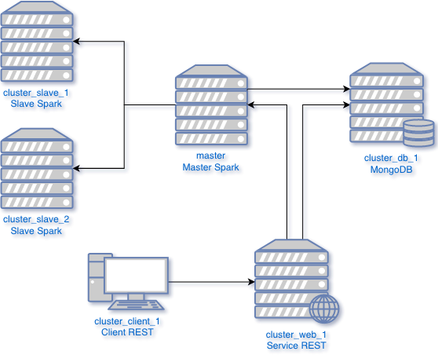

# Instructions

### Construire les containers Docker

`cd cluster`

`docker-compose build`

### Démarrer les containers Docker en choisissant le nombre de slaves

`docker-compose up -d && docker-compose scale slave=2`

### Interfaces
Il est maintenant possible de consulter le client, le Spark UI et le service REST sur localhost.

| URL               | Site web      | 
| ----------------- | ------------- | 
| localhost:80      | client        | 
| localhost:3000    | Service REST  |
| localhost:8080    | Spark UI      |

### Créer la database
Si c'est la première fois que ce docker-compose est exécuté, il faut créer une base de données. Il faut d'abord accéder en ssh à la base de donnée:

`docker-compose exec db bash`

`mongo`

Ensuite créer une base de données nommée log8430-tp4:

`use log8430-tp4`

Créer un utilisateur associé (admin:secret)

```js
db.createUser({
    user: 'admin',
    pwd: 'secret',
    roles: [ "dbOwner" ]
})
```

Créer les collections

```
db.createCollection('products')
db.createCollection('invoices')
```

Redémarrer docker-compose

`docker-compose down`

`docker-compose up -d && docker-compose scale slave=2`

### Envoyer une tâche au master via spark-submit

Se connecter en ssh au container spark-master pour exécuter le script python sur les slaves 

```bash
docker-compose exec master bash /opt/spark/bin/spark-submit --master spark://master:7077 --packages org.mongodb.spark:mongo-spark-connector_2.11:2.3.1 /opt/spark/tasks/FrequentProducts.py
```

On pourra alors voir un travail nommé "frequent-products" commener sur `localhost:8080`. Une fois le travail terminé, il est possible de voir le résultat dans la console. Le résultat possède le format suivant:

`[(product_id, count),(product_id, count),...]`

Les produits sont classés par fréquence d'apparition. Ainsi, le premier `product_id` est également le plus fréquent dans les factures. *On affiche uniquement les produits ayant une fréquence supérieure ou égale à 10*.

Pour créer des produits et des factures, se rendre au client situé à `http://localhost:80`.

# Fonctionnement du système

### Architecture

Les commandes Docker présentées plus haut permettent la création de 5 conteneurs isolés les uns des autres: un client REST, un service REST, une base de données MongoDB, un master Spark ainsi que 2 slaves Spark. L'architecture du système est résumée dans le diagramme d'architecture suivant.

<p align="center"> 
    
</p>
<p align="center"> 
    <i>Architecture du système</i>
</p>

Nous avons utilisé Docker pour automatiser la création de conteneurs au lieu de créer des machines virtuelles pour des raisons de performance et de portabilité (étant donné que le système doit être transmis aux évaluateurs). Conformément aux requis présentés dans l'énoncé, chaque composant du système est indépendant, c'est-à-dire qu'on pourrait assigner chacun d'eux à une machine différente dans un vrai déploiement.

### Flux de travail

Le flux de travail est le même pour toutes les requêtes du client autre que celle visant à identifier les produits fréquents. Lorsque que le client lance ces requêtes, elles sont reçues et traitées par le service REST. Si le travail requiert la lecture ou l'ajout d'information dans la base de données, le service contacte le conteneur sur lequel roule MongoDB pour y lire ou y ajouter des données. Le service REST retourne ensuite une réponse au client dépendemment du succès de la requête.

Dans le cas où le client désire identifier les produits fréquents, il lance ici aussi une requête au service REST. Lorsqu'il reçoit cette requête, le service REST fait une requête au conteneur où se trouve le Master Spark pour lui demander d'exécuter le travail permettant d'identifier les produits qui se produisent fréquement dans les factures de la base de données NoSQL. Le Master contacte alors le conteneur où roule MongoDB pour obtenir un lot de données à analyser. Lorsqu'il dispose de ces données, il lance l'analyse et contacte les deux conteneurs Slave pour leur déléguer le travail. Les conteneurs Slaves accomplissent le travail et retournent le résultat à Master. Master retourne ensuite une réponse au service REST, qui à son tour retourne une réponse à la requête origniellement faite par le client. 

